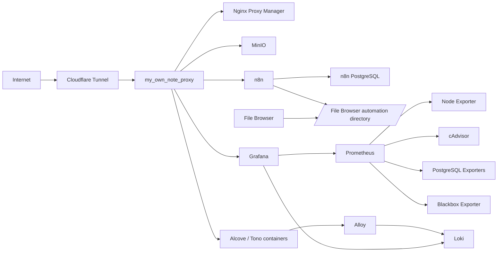

# My Own Note — Home Server Infrastructure

`ellie-server`에서 공용 스토리지, 도메인 라우팅, Cloudflare Tunnel과
Alcove·Tono 모니터링을 운영하는 Docker Compose 저장소입니다.

프로젝트 애플리케이션 코드는 포함하지 않지만 홈서버 공통 포털인 `mano-admin`은 이
저장소에서 함께 관리합니다. `alcove_be`, `tono-be`, `tono-ai` 등의 컨테이너가 함께
사용하는 Docker 네트워크와 관측 시스템도 제공합니다.

## 구성



| 서비스 | 역할 | 호스트 노출 |
| --- | --- | --- |
| Nginx Proxy Manager | 내부 서비스 도메인 라우팅 | `127.0.0.1:80`, `443`, `81` |
| File Browser | 개인 파일 관리 | `127.0.0.1:8081` |
| Mano Admin | 홈서버 관제 및 공통 작업 포털 | `127.0.0.1:3100` |
| Mano Admin PostgreSQL | Admin 작업 데이터 | `${MANO_ADMIN_DB_PORT:-5434}` |
| n8n | 개인 자동화 | `127.0.0.1:5678` |
| n8n PostgreSQL | n8n 전용 DB | Docker 내부 |
| MinIO | 프로젝트 공용 S3 호환 스토리지 | `127.0.0.1:9000`, `9001` |
| cloudflared-mano | Mano 계정 Cloudflare Tunnel | 없음 |
| cloudflared-alcove | Alcove 계정 Cloudflare Tunnel | 없음 |
| Grafana | 대시보드 및 알림 | `127.0.0.1:3000` |
| Loki | 로그 저장 | Docker 내부 |
| Alloy | Docker 로그 수집 | Docker 내부 |
| Prometheus | 지표 저장 및 수집 | Docker 내부 |
| Blackbox Exporter | HTTP health probe | Docker 내부 |
| cAdvisor | 컨테이너 지표 | Docker 내부 |
| Node Exporter | 홈서버 시스템 지표 | Docker 내부 |

로그와 Prometheus 지표의 기본 보존 기간은 30일입니다.

## 디렉터리

```text
.
├── .github/workflows/deploy.yml       # 검증 및 홈서버 자동 배포
├── docker-compose.yml                 # 전체 인프라 스택
├── mano-admin/                        # Next.js 관제 및 공통 작업 포털
├── doppler.yaml                       # mano/prd 시크릿 연결
├── scripts/
│   ├── deploy-home-server.sh          # 안전한 Compose 배포
│   └── validate-config.py             # JSON/YAML 검증
├── monitoring/
│   ├── alloy/                         # Docker 로그 수집
│   ├── blackbox/                      # HTTP probe
│   ├── grafana/                       # 대시보드, 데이터소스, 알림
│   ├── loki/                          # 로그 저장 및 보존 정책
│   └── prometheus/                    # scrape target
└── docs/
```

## 사전 준비

홈서버에는 다음 도구가 필요합니다.

- Docker Engine
- Docker Compose plugin
- Doppler CLI
- Tailscale

버전 확인:

```bash
docker --version
docker compose version
doppler --version
tailscale status
```

Doppler 접근 설정:

```bash
doppler login
doppler setup --project mano --config prd
```

## 환경변수

운영 시크릿은 Git이나 GitHub Actions에 복사하지 않고 Doppler의 `mano/prd`에서
주입합니다.

| 변수 | 용도 |
| --- | --- |
| `MINIO_ROOT_USER` | MinIO 관리자 사용자 |
| `MINIO_ROOT_PASSWORD` | MinIO 관리자 비밀번호 |
| `CLOUDFLARE_TUNNEL_TOKEN` | Mano Tunnel token |
| `CLOUDFLARE_ALCOVE_TUNNEL_TOKEN` | Alcove Tunnel token |
| `GRAFANA_ADMIN_USER` | Grafana 관리자 사용자, 기본 `admin` |
| `GRAFANA_ADMIN_PASSWORD` | Grafana 관리자 비밀번호 |
| `GRAFANA_ROOT_URL` | 외부 Grafana HTTPS 주소 |
| `SLACK_ALCOVE_WEBHOOK_URL` | Alcove 운영 알림 |
| `DISCORD_TONO_WEBHOOK_URL` | Tono 운영 알림 |
| `CF_ACCESS_TEAM_DOMAIN` | Cloudflare Access team domain |
| `CF_ACCESS_AUD` | Mano Admin Access application AUD |
| `CF_ACCESS_ALLOWED_EMAIL` | Mano Admin 허용 개인 이메일 |
| `MANO_ADMIN_DB_PASSWORD` | Mano Admin 전용 PostgreSQL 비밀번호 |
| `MANO_ADMIN_DB_USER` | Mano Admin DB 사용자, 기본 `mano_admin` |
| `MANO_ADMIN_DB_NAME` | Mano Admin DB 이름, 기본 `mano_admin` |
| `MANO_ADMIN_DB_PORT` | Mano Admin DB 호스트 포트, 기본 `5434` |
| `N8N_DB_PASSWORD` | n8n 전용 PostgreSQL 비밀번호 |
| `N8N_ENCRYPTION_KEY` | n8n credential 암호화 키 |
| `N8N_HOST` | n8n 외부 호스트명, 예: `n8n.example.com` |
| `N8N_EDITOR_BASE_URL` | n8n 에디터의 외부 HTTPS URL |
| `N8N_WEBHOOK_URL` | webhook에 사용할 외부 HTTPS URL |
| `N8N_DB_USER` | n8n DB 사용자, 기본 `n8n` |
| `N8N_DB_NAME` | n8n DB 이름, 기본 `n8n` |
| `N8N_PROTOCOL` | 외부 프로토콜, 기본 `https` |
| `N8N_TIMEZONE` | workflow 타임존, 기본 `Asia/Seoul` |

`N8N_ENCRYPTION_KEY`는 저장된 credential 복호화에 필요하므로 최초
배포 후 변경하지 않습니다. 충분히 긴 무작위 문자열을 Doppler에
저장합니다.

설정 확인:

```bash
doppler run --project mano --config prd -- docker compose config --quiet
```

명령 출력에는 시크릿이 포함될 수 있으므로 완성된 Compose 설정을 파일이나 로그로
저장하지 않습니다.

## 최초 실행

```bash
cd /home/ellie/my_own_note

doppler run --project mano --config prd -- \
  docker compose up -d

doppler run --project mano --config prd -- \
  docker compose ps
```

공용 네트워크도 이 과정에서 생성됩니다.

```text
my_own_note_proxy
my_own_note_monitoring
my_own_note_automation
```

`my_own_note_automation`은 n8n과 전용 PostgreSQL의 내부 통신용입니다.
PostgreSQL 포트는 호스트에 공개하지 않습니다.

애플리케이션 Compose는 필요한 네트워크를 external network로 참조합니다. 따라서
새 서버에서는 이 인프라 스택을 애플리케이션보다 먼저 실행합니다.

## CI/CD

GitHub Actions는 Pull Request와 `master` push에서 다음을 검증합니다.

- Grafana dashboard JSON
- 모든 YAML 파일
- Docker Compose interpolation과 구성
- Prometheus 설정
- 배포 스크립트 문법

`master` 검증이 성공하면:

1. Tailscale로 `ellie-server`에 연결합니다.
2. 소스를 `/home/ellie/my_own_note`로 직접 동기화합니다.
3. Doppler 환경에서 Compose 설정을 다시 검증합니다.
4. `docker compose up -d`로 변경된 서비스만 조정합니다.
5. 설정 체크섬이 바뀐 모니터링 서비스만 reload 또는 restart합니다.
6. 모든 Compose 서비스가 실행 중인지 확인합니다.

GitHub 저장소에 필요한 Actions secret:

```text
TAILSCALE_AUTHKEY
```

동기화에서 다음 경로는 보존됩니다.

```text
.env
.deploy-state
```

안전한 배포를 위해 자동 배포에서는 다음 작업을 하지 않습니다.

```text
docker compose down
docker compose pull
docker compose --remove-orphans
docker volume rm
```

## 수동 배포

Actions와 같은 배포 로직을 홈서버에서 직접 실행할 수 있습니다.

```bash
cd /home/ellie/my_own_note
./scripts/deploy-home-server.sh
```

특정 서비스만 확인하거나 다시 적용하려면:

```bash
doppler run --project mano --config prd -- \
  docker compose up -d prometheus grafana
```

## 애플리케이션 연결

로그 수집이 필요한 컨테이너에는 다음 라벨을 지정합니다.

```yaml
labels:
  monitoring.logs: "true"
  monitoring.project: "tono"
  monitoring.service: "ai"
```

프로젝트 값은 현재 `alcove`, `tono`를 사용합니다. Alloy는 라벨을 기준으로 로그를
Loki tenant에 분리해 전송합니다.

PostgreSQL exporter는 각 애플리케이션 Compose에서 실행하며
`my_own_note_monitoring` 네트워크를 통해 Prometheus에 연결됩니다.

## Mano Admin

`mano-admin`은 별도 관리 도구를 대체하지 않는 공통 포털입니다. 서버 자원과
서비스 상태를 Prometheus에서 읽고 File Browser, Grafana, MinIO, n8n 등의 상세
관리 화면으로 연결합니다. Docker socket, 컨테이너 제어, 파일 관리, 자동화 실행
기능은 제공하지 않습니다. Admin PostgreSQL에는 Workspace, Task, Approval,
AutomationRun, Artifact 메타데이터만 저장합니다.

Cloudflare Mano Tunnel의 Public Hostname은 `admin.mano.io.kr`에서
`http://mano-admin:3000`으로 직접 연결하고 기존 Grafana와 같은 Cloudflare Access
개인 이메일 정책을 적용합니다. 자세한 구조와 운영 방법은
[Mano Admin README](mano-admin/README.md)를 참고하세요.

Admin origin도 Access JWT를 검증하므로 Doppler `mano/prd`에
`CF_ACCESS_TEAM_DOMAIN`, `CF_ACCESS_AUD`, `CF_ACCESS_ALLOWED_EMAIL`이 반드시
필요합니다. Published application만 추가한 상태는 인증이 아니므로 Access controls의
Self-hosted application과 개인 이메일 `Allow` 정책을 별도로 생성해야 합니다.
Admin DB를 위해 `MANO_ADMIN_DB_PASSWORD`도 Doppler `mano/prd`에 추가해야 합니다.

## n8n 자동화 환경

n8n은 전용 PostgreSQL을 사용하고, File Browser의 전체 파일 영역이
아닌 다음 자동화 전용 디렉터리만 읽고 쓸 수 있습니다.

| 위치 | 경로 |
| --- | --- |
| 홈서버 | `/srv/filebrowser/files/automation` |
| File Browser | `/srv/automation` |
| n8n | `/files` |

배포 스크립트가 호스트 디렉터리를 먼저 `0770`으로 생성합니다. n8n이
`/files`에 쓰지 못하면 홈서버에서 소유자를 확인합니다.

```bash
ls -ld /srv/filebrowser/files/automation
docker exec n8n sh -c 'id && touch /files/.write-test && rm /files/.write-test'
```

File Browser에서 `automation/blog`, `automation/project`,
`automation/youtube` 같은 하위 디렉터리를 workflow별로 분리할 수
있습니다. OpenAI, Ollama, Codex credential이나 workflow는 사전 설정하지
않습니다.

Nginx Proxy Manager에서 Proxy Host의 Forward Hostname/IP는 `n8n`,
Forward Port는 `5678`로 지정합니다. Doppler의 `N8N_HOST`,
`N8N_EDITOR_BASE_URL`, `N8N_WEBHOOK_URL`은 실제 HTTPS 도메인과 일치해야
합니다.

## 상태 확인

```bash
cd /home/ellie/my_own_note

doppler run --project mano --config prd -- docker compose ps
docker compose logs --tail=100 cloudflared-mano cloudflared-alcove
docker compose logs --tail=100 alloy loki prometheus grafana

curl http://127.0.0.1:3000/api/health
curl http://127.0.0.1:9000/minio/health/live
curl http://127.0.0.1:5678/healthz
```

Prometheus target은 Grafana의 **Explore > Prometheus**에서 확인합니다.

```promql
up
probe_success
n8n_version_info
```

로그는 **Explore > Loki**에서 확인합니다.

```logql
{project="alcove"}
{project="tono"}
{project="tono", service_name="ai"} | json
```

## 장애 대응

서비스가 재시작을 반복하면:

```bash
docker ps --filter status=restarting
docker logs --tail=200 <container>
docker inspect <container> --format '{{json .State}}'
```

디스크 사용량 확인:

```bash
df -h
docker system df
du -sh /var/lib/docker/volumes/* 2>/dev/null
```

운영 데이터가 있는 볼륨에는 `docker compose down -v`, `docker volume prune` 또는
임의의 `docker volume rm`을 실행하지 않습니다.

## 데이터와 백업

다음 named volume에는 영속 데이터가 저장됩니다.

- `minio_data`
- `n8n_data`, `n8n_postgres_data`
- `mano_admin_postgres_data`
- `npm_data`, `npm_letsencrypt`
- `grafana_data`
- `loki_data`
- `prometheus_data`
- `alloy_data`

이 저장소의 Git 백업은 설정만 보존합니다. MinIO 객체, Nginx Proxy Manager 설정,
Grafana 상태와 시계열 데이터는 Docker volume을 별도로 백업해야 합니다.
File Browser와 n8n이 공유하는 `/srv/filebrowser/files/automation`도 별도
백업 대상입니다. n8n 복구에는 `n8n_data`, `n8n_postgres_data`, 공유
디렉터리와 동일한 `N8N_ENCRYPTION_KEY`가 필요합니다.

## 세부 문서

- [모니터링 운영 가이드](monitoring/README.md)
- [Alcove 도메인 이전](docs/world-alcove-domain-migration.md)
